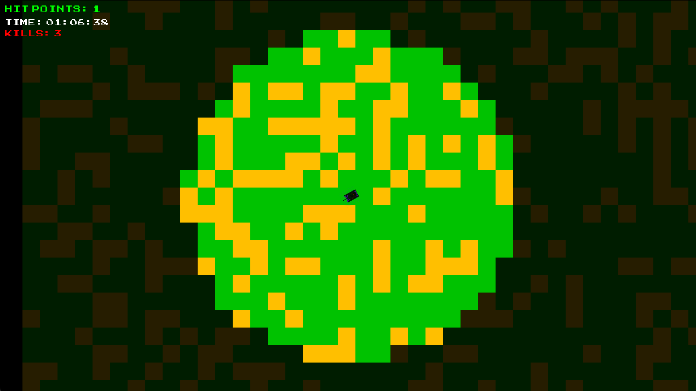

# Nettank

A multiplayer top down 2D tank battle game where players control tanks and try to destroy each other.



## Launching The Game Client

Note: Java 21 Runtime is required to run the game client or the server.

The game client is a universal jar file that can be run on any platform with Java installed. To run the game client, use the following command:

```shell
java -jar nettank-client.jar
```

macOS users may need to use the following command to run the game client:

```shell
java -XstartOnFirstThread -jar nettank-client.jar
```

The game client accesses the game server at `localhost:5555` by default. If you want to connect to a different server, you can specify the server address and port as command line arguments:

```shell
java -jar nettank-client.jar <server_address> <server_port> <player_name>
```

## Launching The Game Server

The gamer server can be deployed using Docker. The following command will build the Docker image and run the server:

To build the Docker image:

```shell
docker build -t nettank-server .
```

To run the Docker container using interactive mode:

```shell
docker run -p 5555:5555 nettank-server
```

To run the Docker container in detached mode (background):

```shell
docker run -d -p 5555:5555 --restart unless-stopped nettank-server
```
