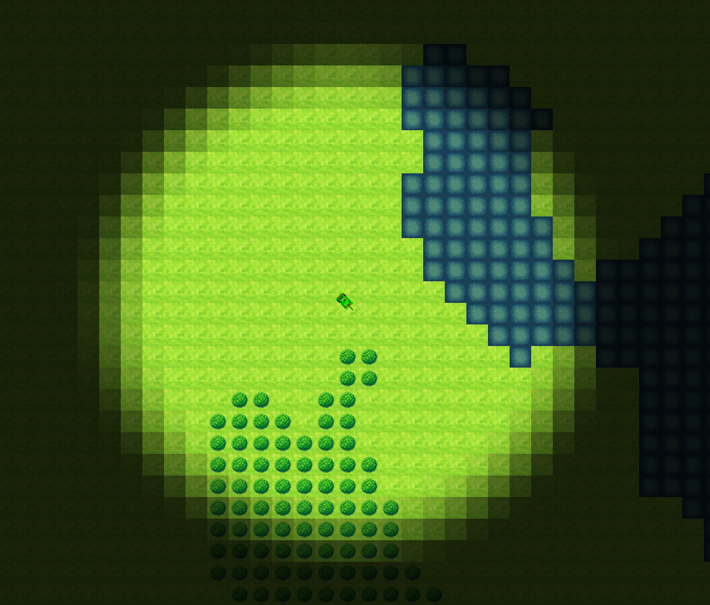

# Nettank

A multiplayer top-down 2D tank battle game where players control tanks and try to destroy each other.



## Requirements

- **Java**: OpenJDK 21 (Java 21) or newer
- **Operating System**: Windows, macOS, or Linux
- **Graphics**: OpenGL 3.3 compatible graphics card

## Controls

### Keyboard (Default)

- **W** - Move forward
- **S** - Move backward
- **A** - Rotate left
- **D** - Rotate right
- **Space** - Fire weapon
- **Escape** - Exit game

### Gamepad (Default)

NetTank supports any standard gamepad including:
- Xbox controllers (Xbox One, Xbox Series X/S, Xbox 360)
- PlayStation controllers (DualShock 4, DualSense)
- Nintendo Switch Pro Controller
- Generic USB gamepads

**Default Gamepad Mapping:**
- **Right Trigger (RT/R2)** - Move forward
- **Left Trigger (LT/L2)** - Move backward
- **Right Stick (horizontal)** - Rotate left/right
- **A button (Xbox) / X button (PlayStation)** - Fire weapon

### Customizing Controls

All keyboard keys and gamepad buttons are fully customizable! See [INPUT_CUSTOMIZATION.md](docs/INPUT_CUSTOMIZATION.md) for:
- How to rebind keys and buttons
- Adjusting gamepad sensitivity and deadzones
- Example configurations (Arrow keys, ESDF layout, etc.)
- Troubleshooting tips

## Game Configuration

Players can customize additional game settings by editing `~/.nettank/game-config.json`:

- **Player Name** - Set your display name (max 20 characters)
- **Display Resolution** - Default: 1920x1080 (1080p)
- **Fullscreen Mode** - Toggle fullscreen/windowed mode
- **VSync** - Enable/disable vertical sync

See [GAME_CONFIG.md](docs/GAME_CONFIG.md) for complete configuration documentation, including:
- All supported resolutions (800x600 up to 4K)
- Configuration examples
- Troubleshooting tips

## Documentation

### For Players
- **[Game Configuration](docs/GAME_CONFIG.md)** - Display, graphics, and player settings
- **[Input Customization](docs/INPUT_CUSTOMIZATION.md)** - Keyboard and gamepad controls

### For Developers
- **[Documentation Index](docs/README.md)** - Complete documentation overview
- **[Terrain System](docs/terrain_system/terrain_system.md)** - Game terrain architecture and features
- **[Quick Reference](docs/terrain_system/terrain_quick_reference.md)** - Fast setup guide for terrain system

## Launching The Game Client

**Note:** OpenJDK 21 (Java 21) Runtime or newer is required to run the game client or the server.

The game client is a universal jar file that can be run on any platform with Java installed.

### Basic Launch (Quick Start)

```shell
java -jar nettank-client.jar
```

### Recommended Launch (Best Performance)

For optimal performance with modern Java features:

```shell
java -XX:+UseG1GC -XX:MaxGCPauseMillis=50 -Xms256m -Xmx512m -jar nettank-client.jar
```

**Parameter Explanation:**
- `-XX:+UseG1GC` - Use G1 garbage collector (low-latency, good for games)
- `-XX:MaxGCPauseMillis=50` - Target max 50ms GC pauses (reduces stuttering)
- `-Xms256m` - Initial heap size (faster startup)
- `-Xmx512m` - Maximum heap size (prevents excessive memory usage)

### macOS-Specific Launch

macOS users need to add `-XstartOnFirstThread` for LWJGL/OpenGL compatibility:

```shell
java -XstartOnFirstThread -XX:+UseG1GC -XX:MaxGCPauseMillis=50 -Xms256m -Xmx512m -jar nettank-client.jar
```

### Connecting to a Remote Server

The game client connects to `localhost:5555` by default. To connect to a different server:

```shell
java -jar nettank-client.jar <server_address> <server_port> <player_name>
```

**Example:**
```shell
java -jar nettank-client.jar 192.168.1.100 5555 MyTankName
```

Or with performance parameters:
```shell
java -XX:+UseG1GC -XX:MaxGCPauseMillis=50 -Xms256m -Xmx512m -jar nettank-client.jar 192.168.1.100 5555 MyTankName
```

## Launching The Game Server

The game server can be run directly with Java or deployed using Docker.

### Running with Java (Direct)

#### Basic Launch

```shell
java -jar nettank-server.jar
```

#### Recommended Launch (Best Performance)

For production servers with optimal performance:

```shell
java -server -XX:+UseG1GC -XX:+UseStringDeduplication -Xms512m -Xmx1024m -jar nettank-server.jar
```

**Parameter Explanation:**
- `-server` - Use server JVM (optimized for throughput over startup time)
- `-XX:+UseG1GC` - Use G1 garbage collector (low-latency)
- `-XX:+UseStringDeduplication` - Reduce memory usage for duplicate strings
- `-Xms512m` - Initial heap size
- `-Xmx1024m` - Maximum heap size (adjust based on player count)

#### Server with Custom Configuration

Specify port, map size, and network update rate:

```shell
java -jar nettank-server.jar <port> <network_hz> <map_width> <map_height>
```

**Example:**
```shell
java -server -XX:+UseG1GC -Xms512m -Xmx1024m -jar nettank-server.jar 5555 60 100 100
```

**Parameters:**
- `port` - Server port (default: 5555)
- `network_hz` - Network update rate in Hz (default: 60, range: 20-120)
- `map_width` - Map width in tiles (default: 100)
- `map_height` - Map height in tiles (default: 100)

### Running with Docker

#### Build the Docker Image

```shell
docker build -t nettank-server .
```

#### Run in Interactive Mode (Foreground)

```shell
docker run -p 5555:5555 nettank-server
```

#### Run in Detached Mode (Background)

```shell
docker run -d -p 5555:5555 --restart unless-stopped nettank-server
```

#### Docker with Custom Port

```shell
docker run -d -p 7777:7777 --restart unless-stopped nettank-server
```

### Performance Tuning

For high-traffic servers (10+ concurrent players), consider increasing heap size:

```shell
java -server -XX:+UseG1GC -XX:+UseStringDeduplication -Xms1024m -Xmx2048m -jar nettank-server.jar
```

For low-resource environments (2-4 players):

```shell
java -server -XX:+UseG1GC -Xms256m -Xmx512m -jar nettank-server.jar
```
